## Datasets

Como primera instancia se verificó la homogeneidad de los datos entre los datasets de entrenamiento y validación. Para ello, se compilo el siguiente código:

```python
import os
import numpy as np
import matplotlib.pyplot as plt
from collections import Counter

# paths dinámicos
train_dir = "data/Split_smol/train"
val_dir = "data/Split_smol/val/"

# 1. Escaneo manual usando funciones nativas de Python
def escanear_carpetas(root_dir):
    conteo = {}
    archivos = []
    if not os.path.exists(root_dir):
        print(f"⚠️ Alerta: El directorio {root_dir} no existe.")
        return conteo, archivos
        
    class_names = sorted(os.listdir(root_dir))
    for cls in class_names:
        cls_dir = os.path.join(root_dir, cls)
        if os.path.isdir(cls_dir):
            # Contamos cuántas imágenes válidas hay por carpeta
            imagenes_clase = [f for f in os.listdir(cls_dir) if f.lower().endswith((".png", ".jpg", ".jpeg"))]
            conteo[cls] = len(imagenes_clase)
            archivos.extend(imagenes_clase)
            
    return conteo, archivos

# Obtener los datos sin usar agrupaciones de Pandas
conteo_train, nombres_train = escanear_carpetas(train_dir)
conteo_val, nombres_val = escanear_carpetas(val_dir)

# Unificar la lista completa de todas las clases detectadas
todas_las_clases = sorted(list(set(list(conteo_train.keys()) + list(conteo_val.keys()))))

# =========================================================
# VERIFICACIÓN 1: Balance de Clases (Distribución)
# =========================================================
print("--- ANALISIS DE BALANCE DE CLASES ---")
print(f"{'Clase':<25} | {'Train':<8} | {'Validation':<10}")
print("-" * 50)
for cls in todas_las_clases:
    t_count = conteo_train.get(cls, 0)
    v_count = conteo_val.get(cls, 0)
    print(f"{cls:<25} | {t_count:<8} | {v_count:<10}")

# Armar listas ordenadas para la gráfica
valores_train = [conteo_train.get(cls, 0) for cls in todas_las_clases]
valores_val = [conteo_val.get(cls, 0) for cls in todas_las_clases]

# Configuración del gráfico de barras agrupadas con Matplotlib puro
x = np.arange(len(todas_las_clases))  
width = 0.35  

plt.figure(figsize=(12, 5))
plt.bar(x - width/2, valores_train, width, label='Train', color='#66c2a5')
plt.bar(x + width/2, valores_val, width, label='Validation', color='#fc8d62')

plt.title('Distribución y Balance de Clases en Train vs Validation')
plt.xlabel('Clases')
plt.ylabel('Cantidad de Imágenes')
plt.xticks(x, todas_las_clases, rotation=45)
plt.grid(axis='y', linestyle='--', alpha=0.7)
plt.legend(title='Dataset')
plt.tight_layout()
plt.show()

# =========================================================
# VERIFICACIÓN 2: Data Repetida (Duplicados por Nombre)
# =========================================================
print("\n--- DETECCIÓN DE DATA REPETIDA (Por nombre de archivo) ---")

# A) Duplicados internos dentro de Train
conteo_nombres_train = Counter(nombres_train)
dup_train = sum(count for count in conteo_nombres_train.values() if count > 1)
print(f"Imágenes con nombre duplicado dentro de TRAIN: {dup_train}")

# B) Duplicados internos dentro de Validation
conteo_nombres_val = Counter(nombres_val)
dup_val = sum(count for count in conteo_nombres_val.values() if count > 1)
print(f"Imágenes con nombre duplicado dentro de VALIDATION: {dup_val}")

# C) Data Leakage (Imágenes que están en Train Y ADEMÁS en Validation)
set_train = set(nombres_train)
set_val = set(nombres_val)
imagenes_filtradas = set_train.intersection(set_val)

print(f"Data Leakage detectado (mismo archivo en Train y Val): {len(imagenes_filtradas)}")

```

Los resultados obtenidos fueron:

--- ANALISIS DE BALANCE DE CLASES ---

Clase                     | Train    | Validation

Actinic keratosis         | 80       | 20        
Atopic Dermatitis         | 81       | 21        
Benign keratosis          | 80       | 20        
Dermatofibroma            | 80       | 20        
Melanocytic nevus         | 80       | 20        
Melanoma                  | 80       | 20        
Squamous cell carcinoma   | 80       | 20        
Tinea Ringworm Candidiasis | 56       | 20        
Vascular lesion           | 80       | 20

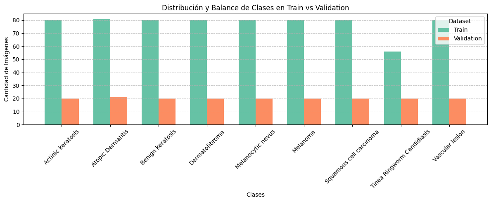

--- DETECCIÓN DE DATA REPETIDA (Por nombre de archivo) ---

Imágenes con nombre duplicado dentro de TRAIN: 0

Imágenes con nombre duplicado dentro de VALIDATION: 0

Data Leakage detectado (mismo archivo en Train y Val): 33


Observaciones:

- Hay datos repetidos entre validación y entrenamiento, lo cual no debe ocurrir.

- La clase 'Tinea Ringworm Candidiasis' está desabalanceada. La relación con las demas en train y validación es distinta. Se debe ajustar para que sean lo más similares posibles.

Corrigiendo esto, se obtuvo:

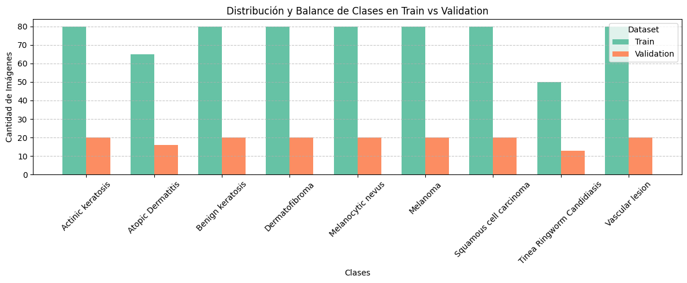

Aquí se puede apreciar que las clases se encuentran balanceadas, y sin repeticiones entre validación y entrenamiento. La relación entre la cantidad de datos en entrenamiento y la cantidad de datos en validación es de alrededor de 4 para todas las clases.

---------------------------------------------------------------------------------------------------------------

El modelo básico, con los datasets ya balanceados, mostró los siguientes resultados en los entrenamientos:


```
| Epoch | Train Loss | Train Accuracy | Val Loss | Val Accuracy |
| :---: | :--------: | :------------: | :------: | :----------: |
|   1   |   2.7972   |     24.15%     |  2.1025  |    33.73%    |
|   2   |   1.8679   |     37.93%     |  1.5378  |    43.20%    |
|   3   |   1.5495   |     46.67%     |  1.7477  |    41.42%    |
|   4   |   1.3446   |     49.33%     |  1.9407  |    40.83%    |
|   5   |   1.2342   |     54.52%     |  1.3937  |    47.34%    |
|   6   |   1.0928   |     56.59%     |  1.3551  |    52.66%    |
|   7   |   1.1629   |     56.30%     |  1.3903  |    53.85%    |
|   8   |   1.1014   |     58.22%     |  1.2339  |    57.40%    |
|   9   |   1.1585   |     57.48%     |  1.3782  |    52.07%    |
|  10   |   1.0818   |     60.30%     |  1.5536  |    41.42%    |
```


## Desarrollo del modelo con las mejoras pedidas

Previo a la busqueda de los hiperparámetros, se desarrollo el código correspondiente para la mejora del modelo simple. Este modelo corresponde al archivo `modelo.ipynb`.

En este modelo se encuentran los siguientes regularizadores:

- Dropout
- Regularización L2
- Batch Normalization

También, cuenta con tres métodos de inicialización:
- Xavier
- Uniform
- Kaiming

### MLPClassifier()

La función de inicialización de éste es:

```python
def __init__(self, input_size=64*64*3, num_classes=10, init_type="kaiming", use_bn=False, use_dropout=False):
  super().__init__()
          
  layers = []
  layers.append(nn.Flatten())

  layers.append(nn.Linear(input_size, 512))
  if use_bn:
      layers.append(nn.BatchNorm1d(512))
  layers.append(nn.ReLU())
  if use_dropout:
      layers.append(nn.Dropout(p=0.5))
      
  layers.append(nn.Linear(512, 256))
  if use_bn:
      layers.append(nn.BatchNorm1d(256))
  layers.append(nn.ReLU())
  if use_dropout:
      layers.append(nn.Dropout(p=0.5))
      
  # Capa de salida
  layers.append(nn.Linear(256, num_classes))

  self.model = nn.Sequential(*layers)
  self.init_weights(init_type)

```
Esta definición cuenta con la posibilidad de elegir:

- Usar dropout o no
- Usar batch normalization o no
- Método de inicialización
- Número de clases (Es adaptable si queremos mejorar el modelo y aceptar más clases)


La distribución de las layers puede visualizarse mejor de la siguiente manera:

```
[Datos Originales] 
       ↓
(Flatten) -> Se estiran en una sola fila
       ↓
(Linear 512) -> Se procesan y expanden a 512 características
       ↓
[BatchNorm] -> Se estabilizan los números (opcional)
       ↓
(ReLU) -> Se eliminan los valores negativos (aporta complejidad)
       ↓
[Dropout] -> Se descartan conexiones al azar para evitar memoria de corto plazo (opcional)
       ↓
(Linear 256) -> Se comprimen a 256 características abstractas
       ↓
[BatchNorm] -> Se vuelven a estabilizar (opcional)
       ↓
(ReLU) -> Otra dosis de complejidad
       ↓
[Dropout] -> Otro filtro anti-sobreajuste (opcional)
       ↓
(Linear num_classes) -> Se transforman en las puntuaciones finales para cada clase
```

Esta forma de plantear el modelo permitió hacer las pruebas necesarias y contrastar los distintos resultados:

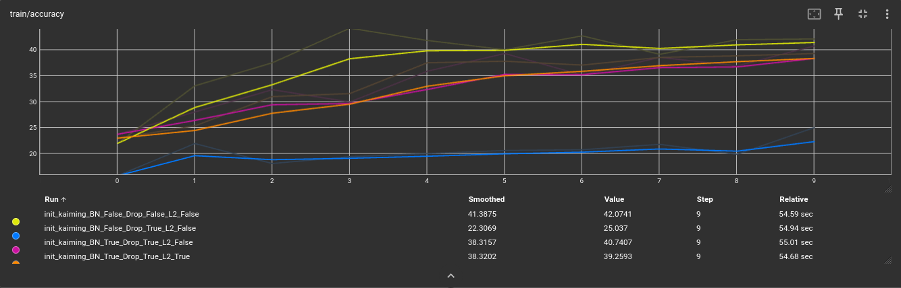
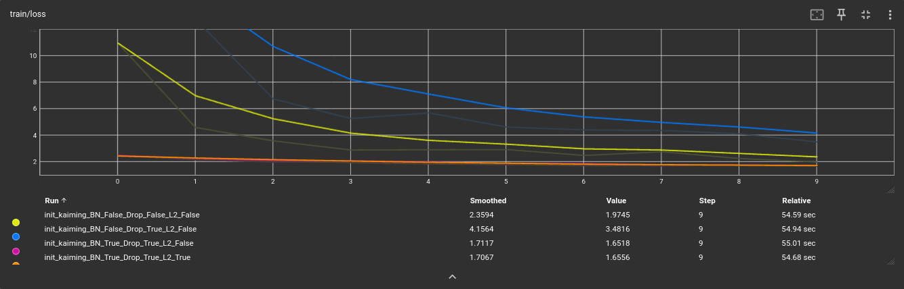
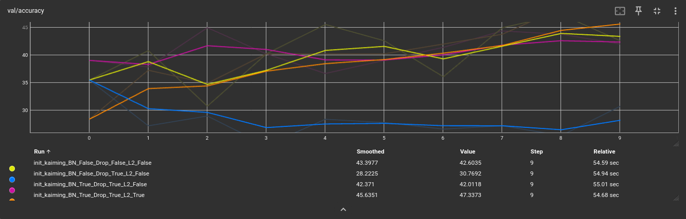
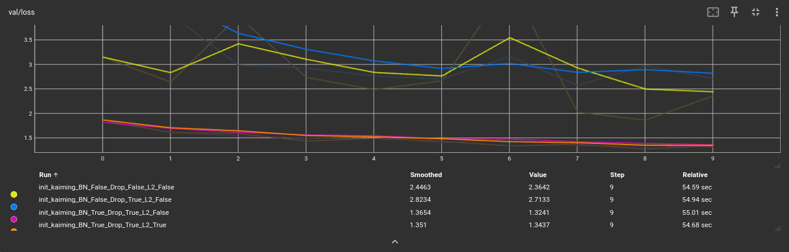

1. Sin dropout

La curva sin regularizadores muestra un rápido descenso de la pérdida y una alta precisión en el entrenamiento debido a que no tiene restricciones para memorizar los datos, pero sus resultados finales en validación son malos y deficientes. Al carecer de regularizadores como Dropout o L2, el modelo se vuelve completamente inestable y caótico, lo que se evidencia en las curvas de validación llenas de picos abruptos, y en una pérdida de validación estancada en valores muy altos. Esto demuestra que la red sufre de overfitting, volviéndose incapaz de generalizar y mantener la estabilidad ante datos nuevos.

2. Con dropout
Los resultados cpn únicamente dropout muestran un rendimiento drásticamente inferior. En train/loss y val/loss, la pérdida empieza en valores altísimos, y desciende muy lentamente, quedando estancada cerca de 4 en entrenamiento y cerca de 2.8 en validación. En consecuencia, su accuracy tanto en entrenamiento como en validación se queda estancada abajo del 25% - 30%.

Es un resultado esperado. El Dropout por sí solo es una técnica de regularización para evitar el overfitting, pero no ayuda a que el modelo converja rápido ni resuelve el problema de la escala de las activaciones. Al usar una inicialización como Kaiming sin normalizar las capas intermedias, los gradientes pueden volverse inestables al principio del entrenamiento, ralentizando por completo el aprendizaje. El Dropout remueve aleatoriamente el 50% de las neuronas, lo que debilita aún más la señal en una red que ya está teniendo problemas para arrancar.


3. Con dropout y normalización 
Al activar Batch Normalization (BN_True), el cambio es radical. La train/loss cae en picada desde la época 0, situándose inmediatamente cerca de 2 y terminando en un óptimo 1.6. El acierto de validación (val/accuracy) escala rápidamente hasta superar el 42%.

Hay una reducción masiva en la pérdida desde el paso 0 si se compara con la línea azul (sólo dropout). El comportamiento de la curva es suave y decreciente de forma constante.

El resultado tiene coherencia compara a lo que se vio con sólo dropout. Batch Normalization escala y centra las activaciones de cada capa. Esto reduce el desajuste covariable interno, permitiendo que los gradientes fluyan de manera óptima. Al estabilizar los datos, la red puede aprender inmediatamente desde la primera época a un ritmo mucho más acelerada.


4. Con dropout, normalización y regularización L2
En val/accuracy, la línea naranja se mantiene consistentemente por encima de la rosa (sin L2), terminando en un valor de ~47%. Sus curvas son, en general, más suaves y muestran una mejor estabilidad a largo plazo. Además, se puede observar como comienza con un valor menor que la curva sin L2, y termina por encima de esta, consiguiendo una convergencia mucho más rápida. En val/loss, termina en el valor más bajo, lo que indica la mejor generalización.

Con regularización L2 se puede observar la mejor opción. La línea naranja demuestra que la sinergia entre las tres herramientas es superior. No solo se estabiliza con BN y se reduce el sobreajuste con Dropout, sino que la regularización L2 añade un control adicional sobre la complejidad del modelo, penalizando los pesos grandes. Esto lleva a una solución más simple y robusta que generaliza mejor ante datos nuevos.


5. Con las distintas inicializaciones, se obtuvieron los siguientes resultados:

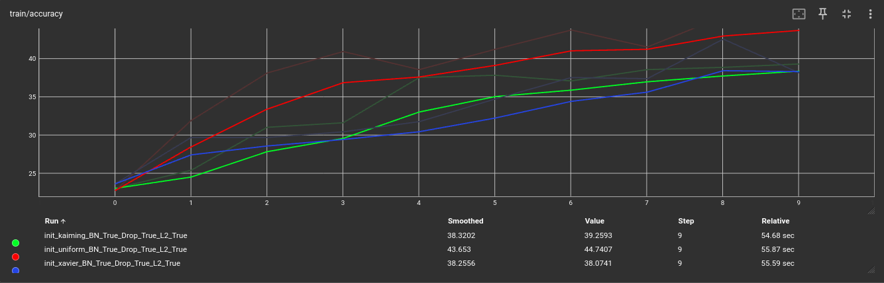
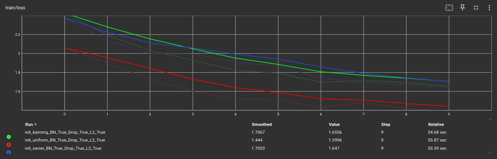
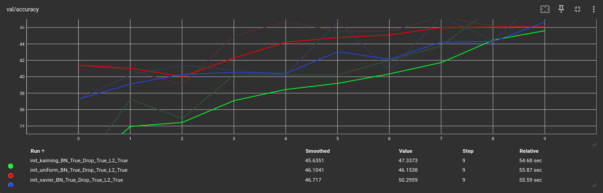
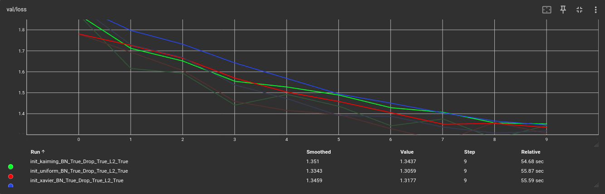


Las gráficas muestran que los tres inicializadores logran excelentes resultados debido a la presencia de todos los regularizadores, aunque con diferencias sutiles en su comportamiento. En el entrenamiento, el inicializador Uniform toma una ventaja inicial en velocidad y precisión, lo cual es esperable, ya que una distribución uniforme bien acotada puede activar las neuronas de manera más homogénea al principio que los métodos basados en varianza orientados a redes profundas como Kaiming o Xavier. Sin embargo, al mirar el rendimiento real en validación, Xavier resulta ser el mejor para este caso. Alcanza la precisión de validación más alta frente a Kaiming y Uniform, manteniendo además una curva de pérdida (val/loss) sumamente suave y decreciente de forma constante. Teóricamente esto es muy lógico, ya que Xavier está matemáticamente diseñado para mantener la varianza de los gradientes estable a través de las capas lineales con activaciones como las de una MLP, logrando aquí encontrar los pesos más equilibrados y con mayor capacidad de generalización ante datos completamente nuevos.

Estos resultados permitieron contrastar correctamente el efecto de los cambios implementados. Aún así, la relación val/accuracy es muy baja, por lo que hay overfitting. Para ello, se busca la mejor condición de hiperparámetros.

### Búsqueda de los hiperparámetros

Adaptando el código del archivo `2_Modelo Simple con búsqueda de HP.ipynb` para los cambios de `modelo.ipynb`, se crearon los archivos `helperModel.ipynb` y `Modelo_HP.ipynb`. Estos archivos se usaron para encontrar los hiperparámetros.

Cuando se ejecutó este código, el mejor espacio de hiperparámetros fue:

```python
{
       'model': 'MLPClassifier', 
       'input_size': 64, 
       'batch_size': 64, 
       'lr': 0.0001, 
       'epochs': 200, 
       'optimizer': 'Adam', 
       'HFlip': 0.0, 
       'VFlip': 0.5, 
       'RBContrast': 0.0, 
       'loss_fn': 'CrossEntropyLoss', 
       'train_dir': 'data/Split_smol/train', 
       'val_dir': 'data/Split_smol/val/', 
       'es_patience': 5, 
       'dropout': 0.1
}

```

Todos los logs de esta ejecución se encuentran en `/mlruns/`.

A partir de estos resultados, se volvió a realizar un entrenamiento al modelo y a testearlo. Estos fueron sus resultados:

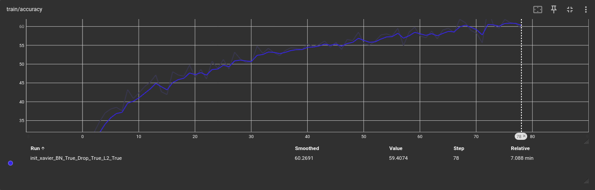
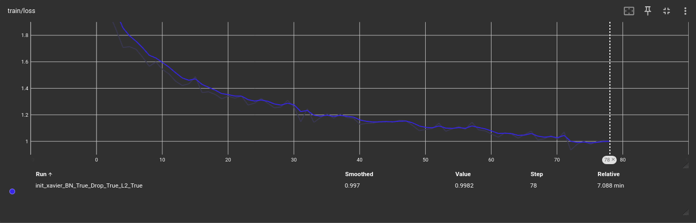
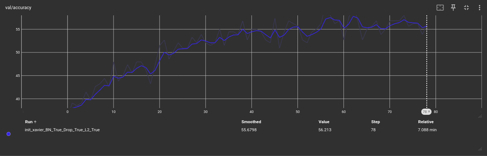
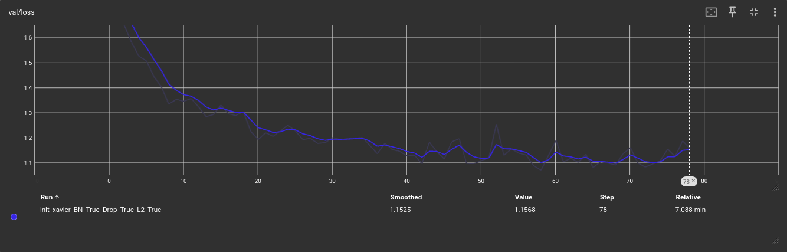

Al analizar los nuevos gráficos con los hiperparámetros optimizados se destacan las siguientes observaciones:

- Las curvas de pérdida (`train/loss` y `val/loss`) y precisión (`train/accuracy` y `val/accuracy`) son notablemente más suaves y progresivas. Se eliminó por completo el comportamiento caótico en forma de "serrucho" que aparecía en los experimentos previos.

- La brecha entre las métricas de entrenamiento y validación se redujo sustancialmente. La pérdida de validación ya no rebota de forma abrupta hacia el final del entrenamiento; en su lugar, decae de manera asintótica y controlada junto a la pérdida de entrenamiento.

- Al reducir el learning rate, la convergencia es más lenta pero mucho más segura. El modelo realiza ajustes finos y estables en sus pesos, lo que explica la regularidad matemática de las curvas.

- La inclusión de reflexiones verticales obligó al modelo a aprender características más genéricas de las imágenes en lugar de memorizar orientaciones fijas, actuando como un regularizador efectivo que complementa al Dropout de 0.1.

En conclusión, los nuevos hiperparámetros lograron estabilizar la dinámica del entrenamiento y optimizaron la capacidad de generalización del modelo, alcanzando curvas con un comportamiento teórico óptimo.


Observación: Se aumentó el valor de `patience` para el Early Stop, ya que 5 era muy bajo, y aunque se usen 200 épocas para entrenar, no superaba las 30 porque no conseguía una validación mejor. Idealmente, la red no se debe estancar, por lo que no se pueden colocar valores muy grandes de patience, pero a partir de los resultados se observo que aumentandolo un poco se lograban mejores resultados.

### Conclusiones

El bajo accuracy en el entrenamiento, estancado por debajo del 45%, no se debe a una falta de capacidad del modelo para memorizar, sino a una combinación crítica entre la escasez de datos y el uso de una arquitectura inadecuada para el problema, usando una MLP en lugar de una Red Neuronal Convolucional (CNN). 

Al aplicar un aplanado directo de la imagen (`Flatten`), la MLP destruye por completo la estructura espacial y las relaciones de contigüidad entre píxeles, forzando a la red a enfrentarse a una lista desordenada de características e induciendo una explosión masiva de parámetros e interconexiones que vuelve el aprendizaje extremadamente ineficiente. Este problema estructural se ve severamente agravado por la baja cantidad de imágenes disponibles, ya que el modelo no cuenta con la variedad suficiente de ejemplos para extraer patrones generales y abstractos, limitándose a confundirse con el ruido del fondo de las capturas. Por lo tanto, para romper este techo de rendimiento y elevar con éxito la precisión, es fundamental abandonar el enfoque MLP en favor de capas convolucionales (`Conv2d`), las cuales preservan la geometría de la imagen y requieren un volumen de datos drásticamente menor, idealmente complementadas con técnicas de aumento de datos para expandir artificialmente el dataset.

Para solucionar la baja cantidad de imágenes se podrían utilizar técnicas que modifiquen las imágenes y aumenten el tamaño del dataset para entrenar y validar.

Por otro lado, una CNN mejora a la MLP en este problema, por lo que si aumentando la cantidad de imágenes no se viesen mejoras del underfitting, se debería pasar directamente al uso de una red CNN.